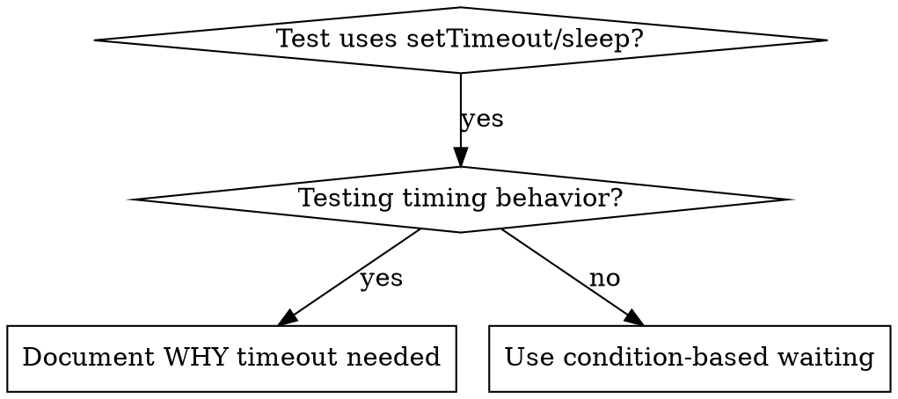

# Condition-Based Waiting

## Skill Usage Announcement

**MANDATORY**: When using this skill, announce it at the start with:

```
🔧 Using Skill: condition-based-waiting | [brief purpose based on context]
```

**Example:**
```
🔧 Using Skill: condition-based-waiting | [Provide context-specific example of what you're doing]
```

This creates an audit trail showing which skills were applied during the session.


## Overview

Flaky tests often guess at timing with arbitrary delays. This creates race conditions where tests pass on fast machines but fail under load or in CI.

**Core principle:** Wait for the actual condition you care about, not a guess about how long it takes.

## When to Use



**Use when:**
- Tests have arbitrary delays (`setTimeout`, `sleep`, `time.sleep()`)
- Tests are flaky (pass sometimes, fail under load)
- Tests timeout when run in parallel
- Waiting for async operations to complete

**Don't use when:**
- Testing actual timing behavior (debounce, throttle intervals)
- Event-based systems available (see "When NOT to Poll" below)
- Always document WHY if using arbitrary timeout

## When NOT to Poll

Polling is NOT appropriate when:

### 1. Event-Based Systems Available

**Use event listeners instead of polling for:**
- WebSockets / Server-Sent Events
- EventEmitter / Message Bus
- DOM events (click, change, etc.)
- Process signals (SIGTERM, etc.)

**Example:**
```typescript
// ❌ BAD: Polling for WebSocket message
let lastMessage;
ws.on('message', msg => lastMessage = msg);
await waitForCondition(() => lastMessage?.type === 'ready');

// ✅ GOOD: Event-based waiting
await new Promise((resolve, reject) => {
  const timeout = setTimeout(() => reject(new Error('Timeout')), 5000);
  ws.once('message', (msg) => {
    if (msg.type === 'ready') {
      clearTimeout(timeout);
      resolve(msg);
    }
  });
});
```

### 2. Native Async Patterns Available

**Use await instead of polling for:**
- Promises
- async/await
- Observable.toPromise()

**Example:**
```typescript
// ❌ BAD: Polling to check if promise resolved
let result;
apiCall().then(r => result = r);
await waitForCondition(() => result !== undefined);

// ✅ GOOD: Just await the promise
const result = await apiCall();
```

### 3. High-Frequency State Changes

**Use reactive patterns instead of polling for:**
- Redux/state management subscriptions
- RxJS observables
- Vue/React reactive state

**Example:**
```typescript
// ❌ BAD: Polling Redux store
await waitForCondition(() => store.getState().user.loggedIn);

// ✅ GOOD: Subscribe to store changes
await new Promise(resolve => {
  const unsubscribe = store.subscribe(() => {
    if (store.getState().user.loggedIn) {
      unsubscribe();
      resolve();
    }
  });
});
```

## When Polling IS Appropriate

Use polling when:
- Checking external system with no event mechanism (third-party API, file system)
- State not controlled by you (browser API, DOM state)
- Testing environment where you can't easily subscribe to events
- Prototyping (event-based can come later)

## Core Pattern

```typescript
// ❌ BEFORE: Guessing at timing
await new Promise(r => setTimeout(r, 50));
const result = getResult();
expect(result).toBeDefined();

// ✅ AFTER: Waiting for condition
await waitFor(() => getResult() !== undefined);
const result = getResult();
expect(result).toBeDefined();
```

## Quick Patterns

| Scenario | Pattern |
|----------|---------|
| Wait for event | `waitFor(() => events.find(e => e.type === 'DONE'))` |
| Wait for state | `waitFor(() => machine.state === 'ready')` |
| Wait for count | `waitFor(() => items.length >= 5)` |
| Wait for file | `waitFor(() => fs.existsSync(path))` |
| Complex condition | `waitFor(() => obj.ready && obj.value > 10)` |

## Implementation

Generic polling function:
```typescript
async function waitFor<T>(
  condition: () => T | undefined | null | false,
  description: string,
  timeoutMs = 5000
): Promise<T> {
  const startTime = Date.now();

  while (true) {
    const result = condition();
    if (result) return result;

    if (Date.now() - startTime > timeoutMs) {
      throw new Error(`Timeout waiting for ${description} after ${timeoutMs}ms`);
    }

    await new Promise(r => setTimeout(r, 10)); // Poll every 10ms
  }
}
```

See @example.ts for complete implementation with domain-specific helpers (`waitForEvent`, `waitForEventCount`, `waitForEventMatch`) from actual debugging session.

## Choosing Polling Interval

**Default: 10-50ms** (recommended for most test cases)

**Shorter intervals (1-10ms):**
- Animations (target 60fps = 16ms)
- Real-time interactions (games, live collaboration)
- High-precision timing requirements
- **Warning:** High CPU usage, use sparingly

**Longer intervals (100-1000ms):**
- Background tasks (file watching, health checks)
- Non-urgent state changes
- Resource-constrained environments
- Polling external APIs (avoid rate limits)

**Exponential backoff:**
- Retrying failed operations (start 100ms, double each attempt, max 5s)
- Unknown timing (connection establishment)
- Balancing responsiveness vs resource usage

**Example: Exponential backoff**
```typescript
async function waitWithBackoff<T>(
  condition: () => T | undefined | null | false,
  description: string,
  maxTimeoutMs = 30000
): Promise<T> {
  const startTime = Date.now();
  let interval = 100; // Start at 100ms

  while (true) {
    const result = condition();
    if (result) return result;

    if (Date.now() - startTime > maxTimeoutMs) {
      throw new Error(`Timeout waiting for ${description} after ${maxTimeoutMs}ms`);
    }

    await new Promise(r => setTimeout(r, interval));
    interval = Math.min(interval * 2, 5000); // Double, max 5s
  }
}
```

## Common Mistakes

**❌ Polling too fast:** `setTimeout(check, 1)` - wastes CPU
**✅ Fix:** Poll every 10ms

**❌ No timeout:** Loop forever if condition never met
**✅ Fix:** Always include timeout with clear error

**❌ Stale data:** Cache state before loop
**✅ Fix:** Call getter inside loop for fresh data

## When Arbitrary Timeout IS Correct

```typescript
// Tool ticks every 100ms - need 2 ticks to verify partial output
await waitForEvent(manager, 'TOOL_STARTED'); // First: wait for condition
await new Promise(r => setTimeout(r, 200));   // Then: wait for timed behavior
// 200ms = 2 ticks at 100ms intervals - documented and justified
```

**Requirements:**
1. First wait for triggering condition
2. Based on known timing (not guessing)
3. Comment explaining WHY

## Real-World Impact

From debugging session (2025-10-03):
- Fixed 15 flaky tests across 3 files
- Pass rate: 60% → 100%
- Execution time: 40% faster
- No more race conditions
