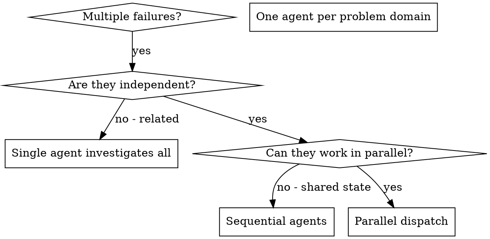

# Dispatching Parallel Agents

## Skill Usage Announcement

**MANDATORY**: When using this skill, announce it at the start with:

```
🔧 Using Skill: dispatching-parallel-agents | [brief purpose based on context]
```

**Example:**
```
🔧 Using Skill: dispatching-parallel-agents | [Provide context-specific example of what you're doing]
```

This creates an audit trail showing which skills were applied during the session.


## Overview

When you have multiple unrelated failures (different test files, different subsystems, different bugs), investigating them sequentially wastes time. Each investigation is independent and can happen in parallel.

**Core principle:** Dispatch one agent per independent problem domain. Let them work concurrently.

## When to Use



**Use when:**
- 3+ test files failing with different root causes
- Multiple subsystems broken independently
- Each problem can be understood without context from others
- Either parallel-safe infrastructure OR sequential fix implementation

**Don't use when:**
- Failures are related (fix one might fix others)
- Need to understand full system state
- Agents would interfere AND fixes must be concurrent

## Prerequisites

**MUST be true** before using parallel agents:

### 1. Failures Are Logically Independent

Each failure can be investigated without knowing about the others:

**Independent failures:**
- Auth failure (login with expired token)
- Payment failure (invalid card)
- Profile failure (missing required field)
- Different features, different root causes

**NOT independent:**
- Auth failure cascades to profile failure
- Payment fails because auth failed first
- Tests fail in sequence due to shared state corruption
- Root cause is shared, investigation must be sequential

### 2. Investigation Is Parallel-Safe

Subagents can work concurrently without interfering:

**Parallel-safe investigation:**
- Reading different source files
- Examining different test files
- Running tests in isolation mode (separate processes/databases)
- Reading git history for different features

**NOT parallel-safe:**
- Tests share database/filesystem (race conditions)
- Tests modify global state/environment variables
- Tests run in same process with shared setup
- Investigation requires modifying same files

**If failures are independent BUT not parallel-safe:**
  You can STILL use this pattern, with modifications:
  1. Dispatch subagents for investigation (reading code, analyzing)
  2. Implement fixes SEQUENTIALLY (not in parallel)
  3. Or set up isolated test environments (Docker containers, separate DBs)

**If failures are NOT independent:**
  Do NOT use parallel agents. Use systematic-debugging to find root cause.

## Decision Tree: When to Use Parallel Agents

```
Do you have 3+ failures?
├─ NO → Use systematic-debugging (single failure investigation)
└─ YES → Continue

Are failures logically independent?
(Can each be investigated without knowing about others?)
├─ NO → Use systematic-debugging (find common root cause)
└─ YES → Continue

Is investigation parallel-safe?
(Can subagents work concurrently without interfering?)
├─ YES → Dispatch parallel agents ✓
└─ NO → Two options:
        A) Dispatch for investigation only, fix sequentially
        B) Set up isolated test environments, then dispatch
```

## The Pattern

### 1. Identify Independent Domains

Group failures by what's broken:
- File A tests: Tool approval flow
- File B tests: Batch completion behavior
- File C tests: Abort functionality

Each domain is independent - fixing tool approval doesn't affect abort tests.

### 2. Create Focused Agent Tasks

Each agent gets:
- **Specific scope:** One test file or subsystem
- **Clear goal:** Make these tests pass
- **Constraints:** Don't change other code
- **Expected output:** Summary of what you found and fixed

### 3. Dispatch in Parallel

```typescript
// In Claude Code / AI environment
Task("Fix agent-tool-abort.test.ts failures")
Task("Fix batch-completion-behavior.test.ts failures")
Task("Fix tool-approval-race-conditions.test.ts failures")
// All three run concurrently
```

### 4. Review and Integrate

When agents return:
- Read each summary
- Verify fixes don't conflict
- Run full test suite
- Integrate all changes

## Agent Prompt Structure

Good agent prompts are:
1. **Focused** - One clear problem domain
2. **Self-contained** - All context needed to understand the problem
3. **Specific about output** - What should the agent return?

```markdown
Fix the 3 failing tests in src/agents/agent-tool-abort.test.ts:

1. "should abort tool with partial output capture" - expects 'interrupted at' in message
2. "should handle mixed completed and aborted tools" - fast tool aborted instead of completed
3. "should properly track pendingToolCount" - expects 3 results but gets 0

These are timing/race condition issues. Your task:

1. Read the test file and understand what each test verifies
2. Identify root cause - timing issues or actual bugs?
3. Fix by:
   - Replacing arbitrary timeouts with event-based waiting
   - Fixing bugs in abort implementation if found
   - Adjusting test expectations if testing changed behavior

Do NOT just increase timeouts - find the real issue.

Return: Summary of what you found and what you fixed.
```

## Common Mistakes

**❌ Too broad:** "Fix all the tests" - agent gets lost
**✅ Specific:** "Fix agent-tool-abort.test.ts" - focused scope

**❌ No context:** "Fix the race condition" - agent doesn't know where
**✅ Context:** Paste the error messages and test names

**❌ No constraints:** Agent might refactor everything
**✅ Constraints:** "Do NOT change production code" or "Fix tests only"

**❌ Vague output:** "Fix it" - you don't know what changed
**✅ Specific:** "Return summary of root cause and changes"

## Examples

### Example 1: Independent + Parallel-Safe → Use Skill

**Failures:**
- Auth test fails (expired token handling)
- Payment test fails (card validation)
- Profile test fails (field validation)

**Check independence:**
- Different features
- Different root causes
- Can investigate without knowing about others

**Check parallel safety:**
- Tests in different files
- Each uses isolated test database (Docker containers)
- No shared mocks or global state
- Running tests won't interfere

**Decision:** Dispatch parallel agents

---

### Example 2: Independent but NOT Parallel-Safe → Modified Approach

**Failures:**
- Auth test fails (expired token handling)
- Payment test fails (card validation)
- Profile test fails (field validation)

**Check independence:**
- Different features
- Different root causes
- Can investigate without knowing about others

**Check parallel safety:**
- All tests use same test database (shared state)
- Tests have `beforeEach(() => resetDatabase())` (race condition)
- Running tests in parallel causes interference

**Decision:** Use modified approach:
1. Dispatch 3 subagents to investigate (read code, analyze logic)
2. Implement fixes SEQUENTIALLY (one at a time, avoiding interference)
3. OR set up isolated test environments first, then dispatch

---

### Example 3: NOT Independent → Don't Use Skill

**Failures:**
- Auth test fails (session creation)
- Profile test fails (requires session)
- Settings test fails (requires session)

**Check independence:**
- Profile and Settings failures caused by Auth failure
- Root cause is shared (session creation broken)
- Cannot investigate Profile/Settings without understanding Auth failure

**Decision:** Do NOT dispatch parallel agents. Use systematic-debugging to find root cause in auth system first.

## When NOT to Use

**Related failures:** Fixing one might fix others - investigate together first
**Need full context:** Understanding requires seeing entire system
**Exploratory debugging:** You don't know what's broken yet
**Shared state:** Agents would interfere (editing same files, using same resources)

## Real Example from Session

**Scenario:** 6 test failures across 3 files after major refactoring

**Failures:**
- agent-tool-abort.test.ts: 3 failures (timing issues)
- batch-completion-behavior.test.ts: 2 failures (tools not executing)
- tool-approval-race-conditions.test.ts: 1 failure (execution count = 0)

**Decision:** Independent domains - abort logic separate from batch completion separate from race conditions

**Dispatch:**
```
Agent 1 → Fix agent-tool-abort.test.ts
Agent 2 → Fix batch-completion-behavior.test.ts
Agent 3 → Fix tool-approval-race-conditions.test.ts
```

**Results:**
- Agent 1: Replaced timeouts with event-based waiting
- Agent 2: Fixed event structure bug (threadId in wrong place)
- Agent 3: Added wait for async tool execution to complete

**Integration:** All fixes independent, no conflicts, full suite green

**Time saved:** 3 problems solved in parallel vs sequentially

## Key Benefits

1. **Parallelization** - Multiple investigations happen simultaneously
2. **Focus** - Each agent has narrow scope, less context to track
3. **Independence** - Agents don't interfere with each other
4. **Speed** - 3 problems solved in time of 1

## Verification

After agents return:
1. **Review each summary** - Understand what changed
2. **Check for conflicts** - Did agents edit same code?
3. **Run full suite** - Verify all fixes work together
4. **Spot check** - Agents can make systematic errors

## Real-World Impact

From debugging session (2025-10-03):
- 6 failures across 3 files
- 3 agents dispatched in parallel
- All investigations completed concurrently
- All fixes integrated successfully
- Zero conflicts between agent changes
